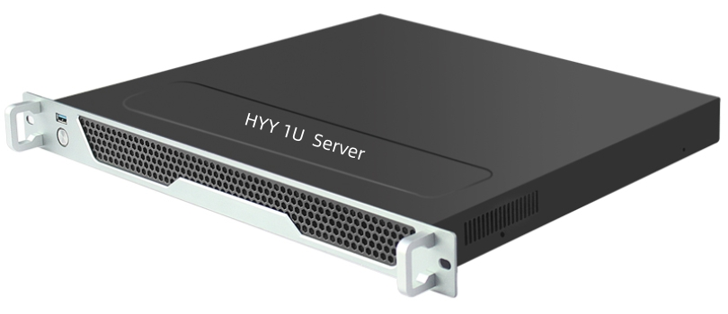
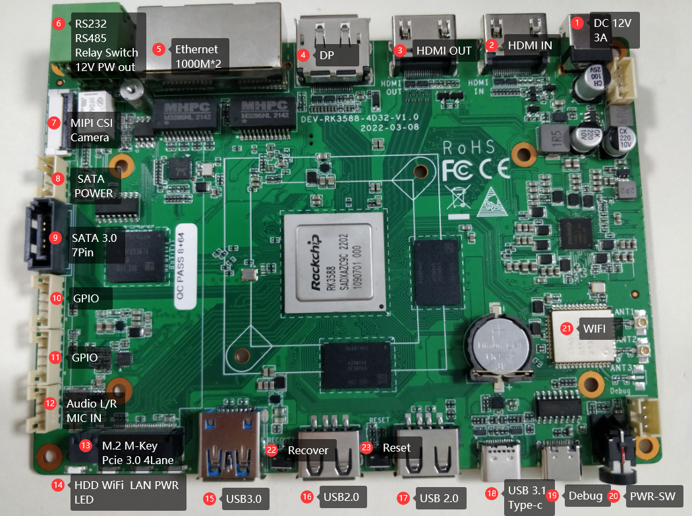
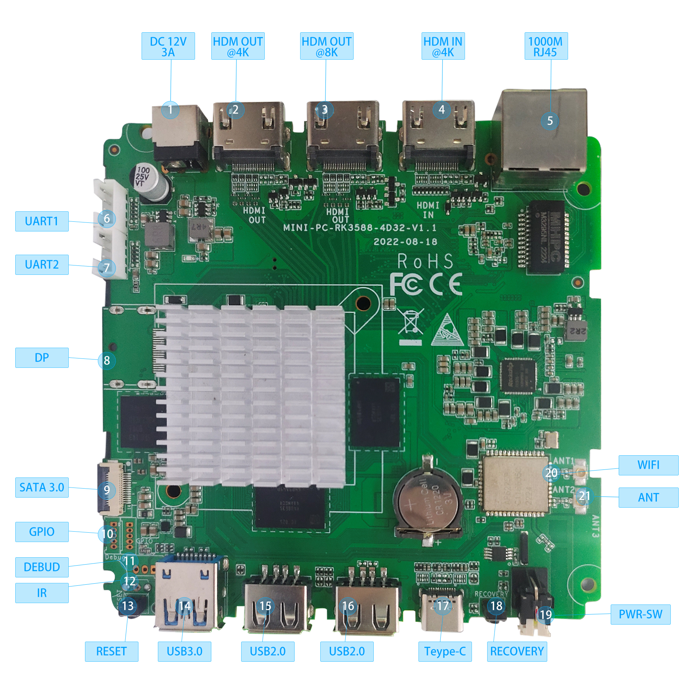
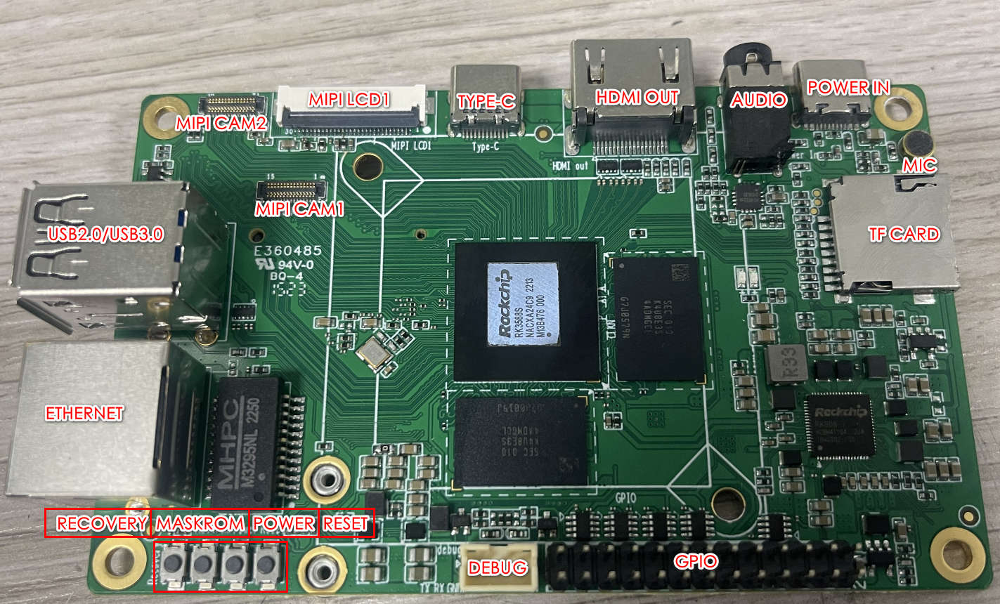
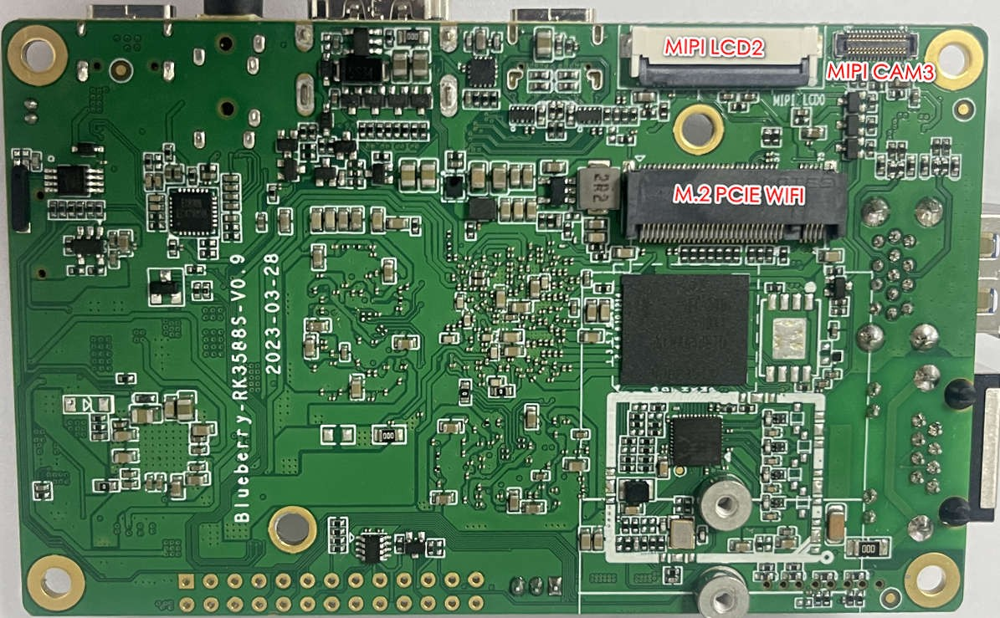

# RK3588-product-data
This repository is RK3588 Development Board Documents

RK3588 specifications are pretty impressive, and the processor will be found in Arm computers, smart displays, edge computing & AIoT solutions, Arm servers, high-performance tablets, network video recorders, virtual reality headsets, and applications AIoT requiring multiple cameras and displays.

# 3588-NAS 
- [3588-NAS.pdf](./RK3588_Documents/3588-NAS.pdf?raw=true)

# F-3588 1U Server 
- [F-3588.pdf](./RK3588_Documents/F-3588-1U-Server.pdf?raw=true)

# NAS-3588 Development Board 
- [3588-NAS.pdf](./RK3588_Documents/3588-NAS.pdf?raw=true)

# H-3588 Development Board 
- [ H-3588-development-board.pdf](./RK3588_Documents/H-3588-development-board.pdf?raw=true)

# HE-3588 Development Board 
- [ HE-3588-development-board.pdf](./RK3588_Documents/HE-3588-development-board.pdf?raw=true)

# Durian Pi

# [Durian Pi HYY-P1](https://github.com/industrialtablet/Durian-Pi)
The DurianPi HYY-P1 adopts the Rockchip RK3588S new generation eight core 64 bit processor, which can be equipped with up to 32GB of large memory; Support 8K video encoding and decoding; Support NVMe SSD hard disk expansion; Support multiple operating systems; It can be applied to edge computing, artificial intelligence, cloud computing, virtual/augmented reality and other fields. RK3588S is a new generation flagship AIoT chip of Rockchip, which adopts 8nm LP process; Equipped with an 8-core 64 bit CPU, with a main frequency of up to 2.4GHz; Integrated ARM Mali-G610 MP4 quad core GPU, built-in AI accelerator NPU, capable of providing 6Tops of computing power, supporting mainstream deep learning frameworks; The powerful RK3588S can bring more optimized performance to various AI application scenarios. The performance far exceeds that of raspberry pies.

# [Durian Pi HYY-D1](https://github.com/hejiangyan/Durian-Pi)
The Durian Pi HYY-D1 is a single board computer designed by HYY company based on the Amlogic S905X3 chip. It adopts a 12nm process, four 64 bit ARM A55 architecture CPUs, integrates G31 GPU, supports 8K encoding and decoding, and supports multiple systems such as Linux and Android. The specifications and performance of HYY-D1 can be completely comparable to Odroid C4 and Raspberry PI 4. In the current global shortage of Raspberry PI, BPI-M5 is a very good substitute. Moreover, the supply of HYY-D1 is relatively stable, which is an advantage for the project.

# RK3588 Specifications(Addtional details)
- CPU – 4x Cortex-A76 @ up to 2.4/2.6 GHz and 4x Cortex-A55 cores @ 1.8 GHz in dynamIQ configuration
- GPU
    - Arm Mali-G610 MP4 “Odin” GPU with support for OpenGLES 1.1, 2.0, and 3.2, OpenCL up to 2.2 and Vulkan1.2
    - 2D graphics engine up to 8192×8192 source, 4096×4096 destination
- AI Accelerator – 6 TOPS NPU 3.0 (Neural Processing Unit)
- VPU
    - Video decoding
        - 8Kp60 H.265, VP9, AVS2, 8Kp30 H.264 AVC/MVC
        - 4Kp60 AV1
        - 1080p60 MPEG-2/-1, VC-1, VP8
    - Real-time 8Kp30 encoding with H.265/H.264; multi-channel encoding supported at lower resolutions
- Memory I/F – LPDDR4/LPDDR4x/LPDDR5 up to 32GB
- Storage – eMMC 5.1, SD/MMC, SATA 3.0 (multiplexed with PCIe 2.0), FSPI (Flexible SPI)
- Video Output
    - Dual HDMI 2.1 / eDP 1.3 up to 8Kp60
    - Dual DisplayPort 1.4a up to 8Kp30 (multiplexed with USB 3.0)
    - Dual MIPI DSI output up to 4Kp60
    - Bt.1120 video output up to 1080p60
    - Optional dual LVDS up to 1080p60 via RK628 chip.
    - Up to four independent displays (up to 1x 8Kp60, 2x 4Kp60, 1x 1080p60)
- Video Input/Camera
    - 48MP (2x 24MP) ISP with HDR and 3D NR support; multi-camera input
    - 2x MIPI DC (4-lane DPHY v2.0 or 3-lane CPHY V1.1)
    - 4x 2-lane MIPI CSI
    - DVP camera interface
    - HDMI Rx 2.0 interface up to 4Kp60 with HDCP 2.3 support
- Audio
    - 2x 8-channel I2S, 2x 2-channel I2S
    - 2x SPDIF
    - 2x 8-channel PDM (for mic arrays)
    - 2-channel digital audio codec (16-bit DAC)
    - VAD engine
- Networking – Dual Gigabit Ethernet
- USB – 2x USB 3.1 Gen 1 up to 5 Gbps (multiplexed with DisplayPort), 1x USB 3.1 Gen 1 (multiplexed with Combo “PIPE PHY2”), 2x USB 2.0 OTG
- PCIe – PCIe 3.0 up to 8 Gbps (1x 4-lane, or 2x 2-lane, or 4x 1-lane, or 1x 2-lane + 2x 1-lane
- 3x Combo PIPE PHY interfaces
    - Combo PIPE PHY0/1 – SATA III or PCIe2.1 up to 5 Gbps
    - Combo PIPE PHY2  – SATA III, PCIe 2.1, or USB 3.0
- Low-speed I/O – 5x SPI, 9x I2C, 10x UART, GPIOs, 12-bit ADC (SARADC)
- Package – FCBGA1088L; 21.45 x 21.45mm
- Manufacturing process – 8nm LP

# Contacts
- E-mail: hejiangyan@hotmail.com
- Wechat: + 86 18672559094
- Skype: hejiangyan_1